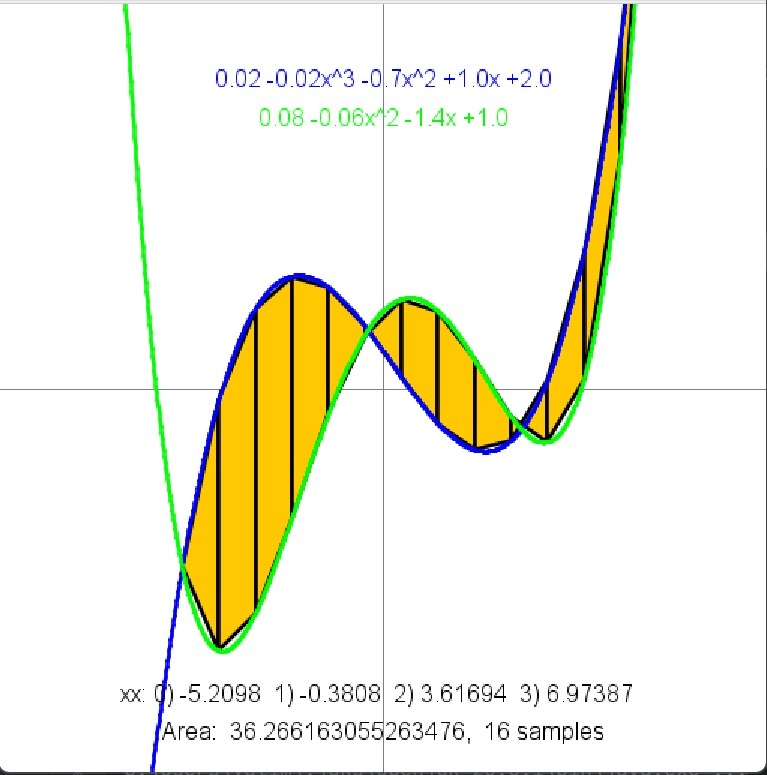

# I2CS_Ex1
f - The given function calculates the value of a polynomial at a specific point $x$, where the **array `poly` holds the coefficients** of the polynomial in **ascending order of their corresponding power of $x$**.

root_rec - The given function recursively finds a **root** (a value of $x$ for which the function equals zero) of a polynomial represented by `p` within the interval $[x1, x2]$ using the **bisection method**, continuing until the function value at the midpoint is less than the specified **tolerance** `eps`.

PolynomFromPoints - The function calculates and returns the **coefficients of the unique polynomial** that passes through a set of given points, represented by the $x$-coordinates in **`xx`** and the corresponding $y$-coordinates in **`yy`**, specifically handling the cases of a **line** (2 points) or a **parabola** (3 points). 

equals - The function attempts to determine if two polynomials, represented by their coefficient arrays **`p1`** and **`p2`**, are equal by **comparing their values at points $x=0, 1, \dots, \min(\text{length}(p1), \text{length}(p2)) - 1$**, although this implementation is generally **incorrect** for proving polynomial equality because it does not test all coefficients and uses the polynomial evaluation function $f(\cdot)$ incorrectly.

poly - The function attempts to **construct a string representation of a polynomial** given its coefficients in the array **`poly`** (where `poly[i]` is the coefficient for $x^i$), but it **incorrectly formats the output string** by concatenating coefficients and powers into terms without proper algebraic notation and traverses the coefficients in a confusing order.

sameValue - The function recursively finds the **$x$-value** within the interval $[x1, x2]$ where two polynomials, represented by their coefficient arrays **`p1`** and **`p2`**, have approximately the **same value** (i.e., where $p1(x) - p2(x) \approx 0$), using the **bisection method** until the difference between their values at the midpoint is less than the specified **tolerance `eps`**. 

length - The function approximates the **arc length** of the curve represented by the polynomial **`p`** over the interval $[x1, x2]$ by dividing the interval into **`numberOfSegments`** equal parts and **summing the lengths of the straight line segments** connecting the polynomial's value at each point, effectively calculating the length of an inscribed polygonal path. 

area - The function approximates the **area between two polynomial curves** represented by **`p1`** and **`p2`** over the interval $[x1, x2]$ by dividing the interval into **`numberOfTrapezoid`** segments and summing the areas of the resulting trapezoids, where a **special case is handled** using the `sameValue` function to accurately calculate the area when the two curves **intersect** within a segment. 

getPolynomFromString - The function **parses a polynomial represented as a string** (e.g., "5x^3 - 2x + 7") into an array of its **coefficients** (where the array index represents the power of $x$), first **determining the maximum degree** to set the array size, then **iterating through each term** to extract and store the corresponding coefficient and power. 

add - The function **adds two polynomials**, represented by their coefficient arrays **`p1`** and **`p2`** (where the array index corresponds to the power of $x$), by creating a new coefficient array whose **length is equal to that of the longer input array** and **summing the corresponding coefficients** of the two polynomials. 

mul - The function **multiplies two polynomials**, represented by their coefficient arrays **`p1`** and **`p2`**, by creating a new coefficient array whose **maximum possible degree is the sum of the degrees of the input polynomials** and then **iterating through all pairs of terms** from $p1$ and $p2$, **multiplying their coefficients** and **adding the result** to the correct corresponding power in the answer array. 

derivative - The function calculates and returns the **coefficient array of the derivative** of the input polynomial **`po`** by applying the **power rule** of differentiation, where the coefficient of $x^n$ in the input polynomial becomes the coefficient of $x^{n-1}$ in the derivative polynomial, scaled by $n$ (i.e., the coefficient of the term of degree $\text{currentDegree}+1$ is multiplied by $\text{currentDegree}+1$). 

summary of the entire code:

ShutterstockThis Java program is designed to implement a basic, object-less mathematical library for working with polynomials, where polynomials are internally represented by an array of their coefficients in ascending order of degree (e.g., poly[i] is the coefficient for $x^i$). The library provides core functionalities essential for polynomial algebra and calculus: calculating the value of a polynomial at a given $x$ ($f(p, x)$), performing basic algebraic operations like addition ($\text{add}$) and multiplication ($\text{mul}$), and calculating the derivative ($\text{derivative}$). Furthermore, it includes numerical analysis tools such as finding the roots of a polynomial using the bisection method ($\text{root\_rec}$), determining the intersection point of two polynomials ($\text{sameValue}$), and approximating the area between two curves ($\text{area}$) and the arc length of a single curve ($\text{length}$) using numerical integration techniques like the trapezoidal rule and inscribed segments, respectively.

